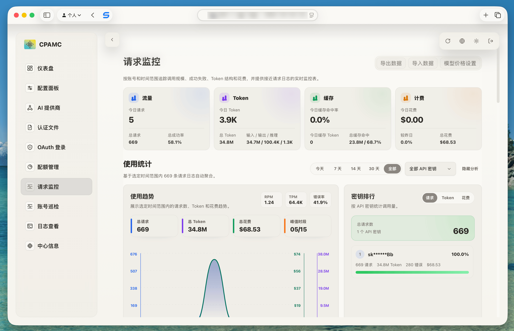
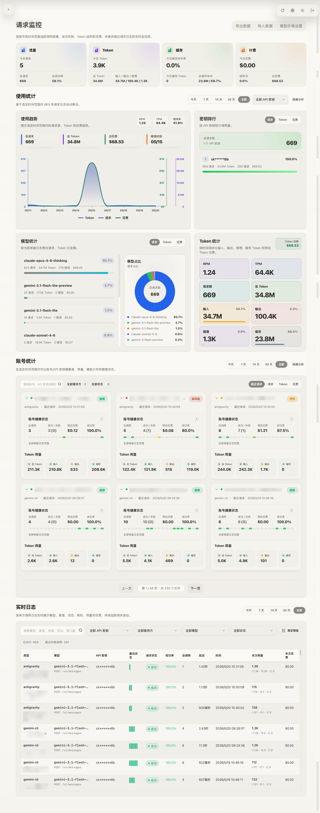

# CLIProxyAPI Pro

CLIProxyAPI Pro 是围绕两个 upstream 项目的最小化定制层与自动发布工程：

- `cliproxyapi-pro-core/`：基于 `router-for-me/CLIProxyAPI` 的后端运行时、Docker 镜像和二进制 release 定制层。
- `cliproxyapi-pro-management/`：基于 `router-for-me/Cli-Proxy-API-Management-Center` 的前端管理中心 overlay 与补丁层。

本仓库不保存 upstream 的完整源码。发布或本地验证时，会拉取 upstream release，将本仓库维护的 patch、overlay 和构建脚本应用到干净 upstream checkout，再生成 Pro 版本产物。

## 当前核心能力

- 请求监控：持久化 usage events，提供请求量、成功率、延迟、token、缓存 token、reasoning token 和成本统计。
- 实时日志：新增 `/realtime-logs` 页面，支持时间范围、API key、provider、model、状态筛选和自动刷新。
- 数据备份：usage JSONL/NDJSON 导入导出，支持 WebDAV 恢复与周期备份。
- SQLite 持久化：保存 usage events、模型价格、quota cache 和监控设置。
- 配额管理增强：配额卡片可显示缓存时间，支持单卡刷新，配额结果可跨页面刷新、浏览器切换和后端重启保留。
- Provider 管理增强：provider 列表按可用项和优先级排序，详情页展示 priority、模型映射和 base URL 外链。
- Runtime 辅助：根路径跳转到 `management.html`，增强 `/healthz`，可选启动 Komari agent。
- 自动发布：GitHub Actions 自动构建 GHCR 多架构镜像、GoReleaser 二进制资产和单文件 `management.html`。

## 项目结构

```text
.
├── cliproxyapi-pro-core/
│   ├── Dockerfile
│   ├── entrypoint.sh
│   ├── embeddedusage/
│   └── patches/
│
├── cliproxyapi-pro-management/
│   ├── apply.sh
│   ├── apply_customizations.py
│   ├── monitoring-locales.json
│   └── overlay/
│
├── .github/workflows/
│   ├── release-core.yml
│   └── release-management.yml
│
├── README.md
└── README_EN.md
```

## 子项目说明

### cliproxyapi-pro-core

后端定制层，用于构建 Pro Docker 镜像和 Pro 二进制 release 资产。

主要内容：

- Docker 构建时下载 upstream CLIProxyAPI release，并应用本仓库后端 patch。
- 复制 `embeddedusage/` 到 upstream `internal/embeddedusage`，随主 API 进程启动 SQLite usage service。
- 注册 `/v0/management/usage` 系列接口，包含聚合数据、最近事件、增量事件、SSE stream、导入导出、quota cache、模型价格和监控设置。
- 启动时强制 Pro 依赖配置：`usage-statistics-enabled=true` 和 Pro 管理面板仓库。
- 支持 WebDAV usage 恢复、WebDAV 周期备份设置和过期备份清理。
- 支持可选 Komari agent：同时配置 `KOMARI_SERVER` 与 `KOMARI_SECRET` 时启动。
- 将 `/` 跳转到 `/management.html`，并增强 `/healthz` 响应。

详见：

- `cliproxyapi-pro-core/README.md`
- `cliproxyapi-pro-core/README_EN.md`

### cliproxyapi-pro-management

前端管理中心定制层，用于在 upstream management center 上生成 Pro 单文件 `management.html`。

主要内容：

- 新增 `/monitoring` 请求监控页面。
- 新增 `/realtime-logs` 实时日志页面。
- 将 usage、模型价格、quota cache 和监控设置接入 customized core API。
- 对请求元数据中的敏感 token-like 文本进行遮罩。
- 在主布局中启动 quota persistence bootstrap，将 SQLite quota cache 同步到前端 quota store。
- 增强 quota 卡片缓存时间显示和单卡刷新。
- 增强 provider 页面：优先级 badge、disabled 排序、详情模型信息和 base URL 链接。
- 通过 `monitoring-locales.json` 合并多语言文案。

详见：

- `cliproxyapi-pro-management/README.md`
- `cliproxyapi-pro-management/README_EN.md`

## 界面预览

<div align="center">

### 请求监控


### 请求监控全览


</div>

更多预览请查看 `assets/` 目录。

## 前后端依赖关系

`cliproxyapi-pro-management` 的新增页面依赖 `cliproxyapi-pro-core` 提供的增强 management API。如果只使用 upstream 后端，请求监控、实时日志、SQLite 持久化、模型价格和配额缓存功能会显示错误或空数据。

核心依赖接口包括：

```text
/v0/management/usage
/v0/management/usage/status
/v0/management/usage/recent-events
/v0/management/usage/events
/v0/management/usage/stream
/v0/management/usage/export
/v0/management/usage/import
/v0/management/usage/quota-cache
/v0/management/usage/model-prices
/v0/management/usage/settings
```

后端启动时会强制：

```text
usage-statistics-enabled=true
remote-management.panel-github-repository=https://github.com/yancj9ya/CLIProxyAPI-PLUS
```

只有加载到的配置不一致时才会同步回写 `config.yaml`。

## Release 与自动发布

### 统一 Pro Release

Workflow：

```text
.github/workflows/release-core.yml
```

触发方式：

- 手动 `workflow_dispatch`
- 每 3 小时定时检查 upstream core release

Release 版本号以 upstream core tag 为基础，并追加 `-pro` 后缀。例如 upstream core 为 `v7.1.18` 时，Pro release tag 为：

```text
v7.1.18-pro
```

流程概览：

1. 检查 upstream `router-for-me/CLIProxyAPI` 最新 release。
2. 检查 upstream `router-for-me/Cli-Proxy-API-Management-Center` 最新 release。
3. 构建并推送 `linux/amd64`、`linux/arm64` GHCR Docker 镜像。
4. checkout upstream core release，应用 core patch，复制本仓库 README，并用 GoReleaser 构建 Pro 二进制资产。
5. checkout upstream management release，应用 management overlay，使用 Bun 构建单文件 `management.html`。
6. 创建或更新当前仓库 GitHub Release，上传二进制、`checksums.txt` 和 `management.html`。
7. release notes 记录 core upstream、management upstream、upstream commit 和 customization commit。
8. 可选执行多实例 usage WebDAV 备份、Render deploy hook、Telegram 通知和 workflow run 清理。

Docker 镜像发布到 GHCR：

```text
ghcr.io/<owner>/cliproxyapi-pro:latest
ghcr.io/<owner>/cliproxyapi-pro:<release-tag>
```

二进制资产平台和压缩格式与 upstream CLIProxyAPI 保持一致，资产名前缀保持为 `CLIProxyAPI`：

```text
CLIProxyAPI_7.1.18-pro_linux_amd64.tar.gz
CLIProxyAPI_7.1.18-pro_linux_aarch64.tar.gz
CLIProxyAPI_7.1.18-pro_darwin_amd64.tar.gz
CLIProxyAPI_7.1.18-pro_darwin_aarch64.tar.gz
CLIProxyAPI_7.1.18-pro_freebsd_amd64.tar.gz
CLIProxyAPI_7.1.18-pro_freebsd_aarch64.tar.gz
CLIProxyAPI_7.1.18-pro_windows_amd64.zip
CLIProxyAPI_7.1.18-pro_windows_aarch64.zip
checksums.txt
management.html
```

归档内 README 使用本仓库的 `README.md` 和 `README_EN.md`。

### Management 资产更新

Workflow：

```text
.github/workflows/release-management.yml
```

触发方式：

- 手动 `workflow_dispatch`
- `main` 分支中 `cliproxyapi-pro-management/**` 或该 workflow 变更
- 每天定时检查 management upstream release

该 workflow 不创建独立 release。它只在当前仓库已有 latest release 时，重建并覆盖 latest release 中的 `management.html`，同时更新 release notes 里的 management 版本映射。

## 本地构建与验证

### 构建 core Docker 镜像

本地构建 latest upstream：

```bash
docker build -t cliproxyapi-pro ./cliproxyapi-pro-core
```

指定 upstream release 和 Pro runtime 版本：

```bash
docker build \
  --build-arg CLIPROXY_VERSION=v7.1.18 \
  --build-arg CLIPROXY_BUILD_VERSION=v7.1.18-pro \
  -t cliproxyapi-pro:v7.1.18-pro \
  ./cliproxyapi-pro-core
```

可用 build args：

- `CLIPROXY_REPO`：upstream 仓库，默认 `router-for-me/CLIProxyAPI`。
- `CLIPROXY_VERSION`：upstream release tag；为空时 Dockerfile 自动解析 latest release。
- `CLIPROXY_BUILD_VERSION`：写入运行时版本号；为空时使用 upstream 版本。
- `GITHUB_TOKEN`：可选 GitHub API token。

### 应用 management 定制层

对 upstream management checkout 应用 overlay：

```bash
./cliproxyapi-pro-management/apply.sh /path/to/Cli-Proxy-API-Management-Center
```

等价命令：

```bash
python3 ./cliproxyapi-pro-management/apply_customizations.py /path/to/Cli-Proxy-API-Management-Center
```

目标目录必须包含：

- `src/`
- `package.json`

应用后在目标目录执行：

```bash
bun install --frozen-lockfile
bun run build
```

### CI 中的实际构建命令

Management release workflow 使用：

```bash
bash customizations-repo/cliproxyapi-pro-management/apply.sh upstream
cd upstream
bun install --frozen-lockfile
bun run build
```

Core binary release workflow 使用：

```bash
python3 customizations-repo/cliproxyapi-pro-core/patches/apply_upstream_patches.py
cd upstream-core
go mod tidy
goreleaser release --clean --skip=publish --skip=validate -f .goreleaser.pro.yml
```

Core 本地验证可参考 `cliproxyapi-pro-core/README.md` 中的 upstream checkout 验证步骤。

## Runtime 数据目录

core 镜像默认使用：

```text
/CLIProxyAPI/usage
```

该目录保存：

- usage SQLite 数据库：`usage.sqlite`
- quota cache
- model prices
- monitoring settings

Usage 导入导出使用 NDJSON 元数据记录保存模型价格、quota cache 和监控设置，因此 WebDAV 备份恢复可以随 usage events 一起恢复监控相关状态。

监控日志保留会在每天服务器本地时间 02:00 自动清理，保存设置时也会立即清理一次；WebDAV 备份可单独设置保留天数，成功备份后会删除过期的 `usage-export-*.jsonl` 文件。

生产环境建议为 `/CLIProxyAPI/usage` 配置持久化 volume。

## 关键环境变量

### Usage service

```text
USAGE_SERVICE_ENABLED
USAGE_DATA_DIR
USAGE_DB_PATH
USAGE_BATCH_SIZE
USAGE_POLL_INTERVAL_MS
USAGE_QUERY_LIMIT
```

### WebDAV 恢复

```text
WEBDAV_URL
WEBDAV_USERNAME
WEBDAV_PASSWORD
MANAGEMENT_PASSWORD
```

### Komari agent

```text
KOMARI_SERVER
KOMARI_SECRET
```

### Release workflow secrets

```text
DOCKER_USERNAME
DOCKER_PASSWORD
CLIPROXY_USAGE_BACKUP_TARGETS
CLIPROXY_RENDER_DEPLOY_HOOKS
TELEGRAM_CHAT_ID
TELEGRAM_BOT_TOKEN
```

完整运行时说明见 `cliproxyapi-pro-core/README.md`。

## 设计原则

本项目遵循最小化定制原则：

- 不复制 upstream 完整源码。
- 只维护可重复应用的 patch、overlay、脚本和 workflow。
- upstream 更新时重新应用定制层，而不是长期维护完整 fork。
- 前端依赖后端增强 API，后端不反向依赖前端实现。
- 文档、脚本和 workflow 尽量保持可验证、可重复。

## 版权与鸣谢

本仓库是围绕 upstream 项目的定制层和发布流程，不声明拥有 upstream 代码、名称或资源的版权。upstream 代码和产物仍保留其原始版权声明和许可证。

- `router-for-me/CLIProxyAPI` 使用 MIT License。其 upstream `LICENSE` 当前声明：
  - Copyright (c) 2025-2005.9 Luis Pater
  - Copyright (c) 2025.9-present Router-For.ME
- `router-for-me/Cli-Proxy-API-Management-Center` 使用 MIT License。其 upstream `LICENSE` 当前声明：
  - Copyright (c) 2026 Router-For.ME

特别鸣谢：

- [router-for-me/CLIProxyAPI](https://github.com/router-for-me/CLIProxyAPI) — 本项目 core 定制层所基于的 upstream 后端项目。
- [router-for-me/Cli-Proxy-API-Management-Center](https://github.com/router-for-me/Cli-Proxy-API-Management-Center) — 本项目 management 定制层所基于的 upstream 管理 UI 项目。
- [seakee/CPA-Manager](https://github.com/seakee/CPA-Manager) — 重要的 CLIProxyAPI 管理与监控项目，对 Pro usage 和 monitoring 方向提供了参考。
- 感谢 [Linux.do](https://linux.do/) 社区对项目推广与反馈的支持。

## 参考文档

- Core 中文文档：`cliproxyapi-pro-core/README.md`
- Core English README：`cliproxyapi-pro-core/README_EN.md`
- Management 中文文档：`cliproxyapi-pro-management/README.md`
- Management English README：`cliproxyapi-pro-management/README_EN.md`
- English project overview：`README_EN.md`
